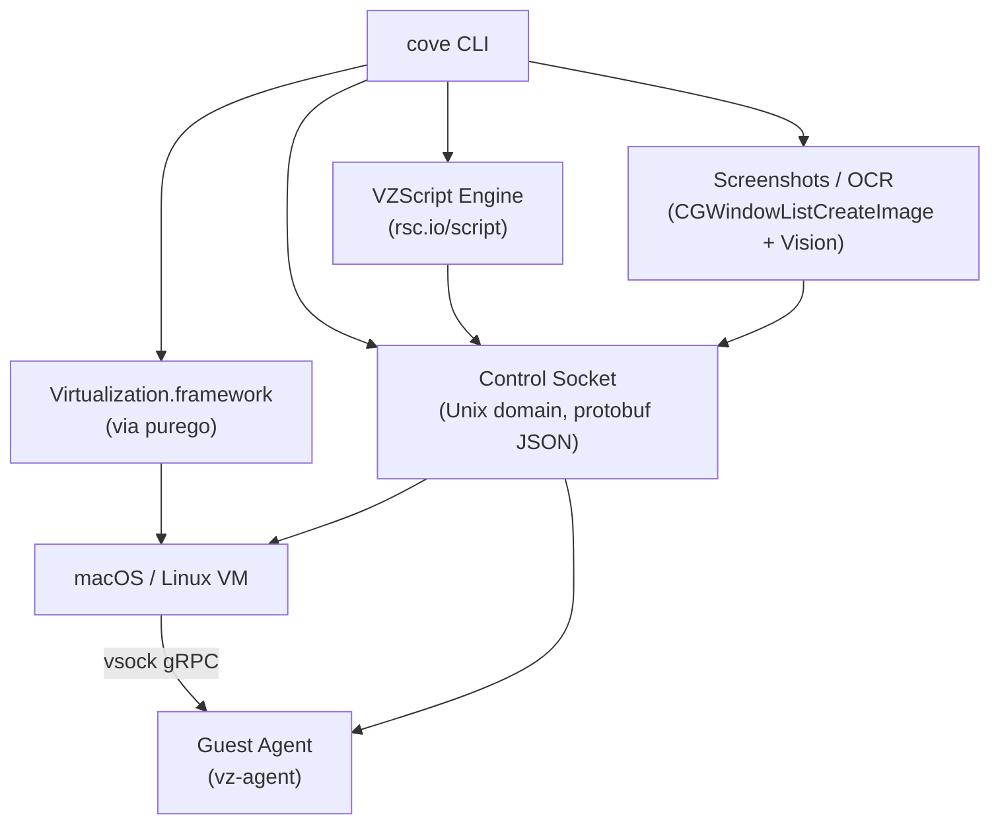

# cove Documentation

macOS VMs that suspend, snapshot, and script.

cove is a CLI for creating and managing macOS and Linux virtual machines on Apple Silicon using Apple's Virtualization.framework. Pure Go, cgo-free ([purego](https://github.com/ebitengine/purego)).

## Get a VM running

```bash
go install github.com/tmc/cove@latest
cove up -user me
```

That downloads the latest macOS IPSW, installs, provisions a user named `me`, and boots to desktop. ~5 minutes on an M3.

Need Linux? `cove up -linux -user me`. Want to pull from a registry instead of installing from scratch? See [Push & Pull](getting-started/push-pull.md).

## Quick Links

- [Installation](getting-started/install.md) -- source build and first-run requirements
- [Quick Start](getting-started/quickstart.md) -- three paths to a running VM
- [CLI Reference](reference/cli.md) -- every command and flag
- [Cove after Cirrus CI](landing/cove-vs-cirrus.md) -- private landing-page draft for the June 2026 Cirrus shutdown window
- [Quickstart from Cirrus](quickstart-from-cirrus.md) -- five-step private-repo migration path
- [Cirrus Migration](migrations/from-cirrus.md) -- translate `.cirrus.yml` jobs to cove-backed GitHub Actions
- [VZScript Commands](reference/vzscript-commands.md) -- guest agent and OCR automation
- [Shared Folders Reference](reference/shared-folders.md) -- persist-vs-live VirtioFS behavior
- [Control Socket API](reference/control-api.md) -- programmatic VM control
- [License and Virtualization Limits](reference/license-comparison.md) -- Apple SLA and project-license comparison
- [Release Checklist](reference/release-checklist.md) -- pre-tag and publish gates

## Feature Highlights

| Feature | Description |
|---------|-------------|
| **Suspend/Resume** | VMs suspend to disk on quit, resume where they left off |
| **Snapshots** | VM state snapshots and APFS copy-on-write disk snapshots |
| **VZScript** | Declarative recipes for guest configuration (rsc.io/script) |
| **Guest Agent** | vsock gRPC agent for command execution, file transfer, clipboard |
| **SIP Management** | Automated recovery boot for enabling/disabling SIP |
| **Provisioning** | Disk injection or GUI automation for unattended setup |
| **Linux VMs** | Ubuntu, Debian, Fedora, and Alpine with unattended install, EFI boot, Rosetta x86-64 translation |
| **Native GUI** | AppKit window with toolbar, menu bar, multi-display |

## Architecture



## Requirements

- Apple Silicon Mac (M1/M2/M3/M4)
- macOS 12.0+ (Monterey or later)
- Xcode Command Line Tools

## Maturity

| Level | Features |
|-------|----------|
| GA | install, run, provisioning, vzscripts, suspend/resume |
| Beta | snapshots, guest agent, clipboard sharing, shared folders, Linux guests, OCI push/pull, VM fork/restore, `cove compact`, local content-addressed store, `cove build` for local VM-directory bases (cache-aware execution, `# secret:` tmpfs, compaction) |
| Experimental | `cove build` registry-base execution and registry cache import/export (planning-only), UTM import, memory balloon, Windows stub |
