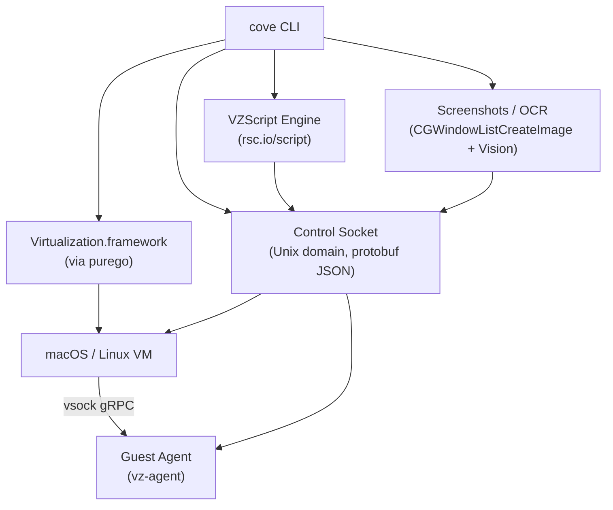

# cove Documentation

macOS VMs that suspend, snapshot, and script.

cove is a CLI for creating and managing macOS and Linux virtual machines on Apple Silicon using Apple's Virtualization.framework. Pure Go, cgo-free ([purego](https://github.com/ebitengine/purego)).

## Get a VM running

```bash
go install github.com/tmc/cove/cmd/cove@latest
cove up -user me
```

That downloads the latest macOS IPSW, installs, provisions a user named `me`, and boots to desktop. ~5 minutes on an M3.

Need Linux? `cove up -linux -user me`. Want to pull from a registry instead of installing from scratch? See [Push & Pull](getting-started/push-pull.md).

## I want to...

| I want to... | Start here |
|---|---|
| Install cove | [Install cove](getting-started/install.md) |
| Get one VM running, fast | [Quick start](getting-started/quickstart.md) |
| Learn cove properly, start to finish | [Tutorial: provision and snapshot your first VM](getting-started/first-vm.md) |
| Fix a VM that will not start | [Troubleshooting](guides/troubleshooting.md) |
| Understand what cove does underneath | [How cove works](architecture/overview.md) |
| Run macOS CI jobs | [macOS CI runner](examples/ci-runner.md) |
| Give an AI agent a sandbox | [Agent sandbox quickstart](agent-sandbox/quickstart.md) |
| Look up a command or flag | [CLI reference](reference/cli.md) |
| Drive a VM from my own code | [Control socket API](reference/control-api.md) |

New to cove? Do the [tutorial](getting-started/first-vm.md) — it builds a VM,
runs a command inside it, snapshots it, and deletes it, which is the shape of
every other workflow here.

## More reference

- [CLI Reference](reference/cli.md) -- every command and flag
- [VZScript Commands](reference/vzscript-commands.md) -- guest agent and OCR automation
- [Shared Folders Reference](reference/shared-folders.md) -- persist-vs-live VirtioFS behavior
- [Control Socket API](reference/control-api.md) -- programmatic VM control
- [Fleet Control Plane](reference/fleet-control-plane.md) -- private controller and worker protocol
- `License and Virtualization Limits` -- Apple SLA and project-license comparison
- [Release Checklist](reference/release-checklist.md) -- pre-tag and publish gates

## Feature Highlights

| Feature | Description |
|---------|-------------|
| **Suspend/Resume** | VMs suspend to disk on quit, resume where they left off |
| **Snapshots** | VM state snapshots and APFS copy-on-write disk snapshots |
| **VZScript** | Declarative recipes for guest configuration (rsc.io/script) |
| **Guest Agent** | vsock gRPC agent for command execution, file transfer, clipboard |
| **SIP Management** | Automated recovery boot for enabling/disabling SIP |
| **Provisioning** | Disk injection or GUI automation for unattended setup |
| **Linux VMs** | Ubuntu, Debian, Fedora, and Alpine with unattended install, EFI boot, Rosetta x86-64 translation |
| **Native GUI** | AppKit window with toolbar, menu bar, multi-display |

## Architecture


```mermaid
graph TD
    CLI["cove CLI"] --> VF["Virtualization.framework<br/>(via purego)"]
    VF --> VM["macOS / Linux VM"]

    CLI --> CS["Control Socket<br/>(Unix domain, protobuf JSON)"]
    CS --> VM

    CLI --> VS["VZScript Engine<br/>(rsc.io/script)"]
    VS --> CS

    VM -->|vsock gRPC| GA["Guest Agent<br/>(vz-agent)"]
    CS --> GA

    CLI --> SS["Screenshots / OCR<br/>(CGWindowListCreateImage + Vision)"]
    SS --> CS
```

## Requirements

- Apple Silicon Mac (M1/M2/M3/M4)
- macOS 14.0+ (Sonoma or later)
- Xcode Command Line Tools

## Maturity

| Level | Features |
|-------|----------|
| GA | install, run, provisioning, vzscripts, suspend/resume |
| Beta | snapshots, guest agent, clipboard sharing, shared folders, Linux guests, OCI push/pull, VM fork/restore, `cove compact`, local content-addressed store, `cove build` for local VM-directory and registry bases (cache-aware execution, OCI cache import/export, `# secret:` tmpfs, compaction) |
| Experimental | UTM import, memory balloon, Windows stub |
