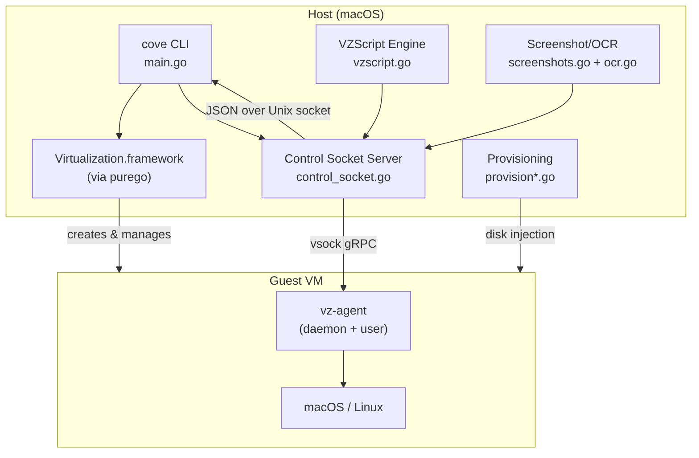
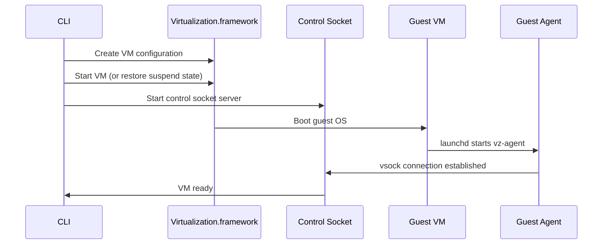
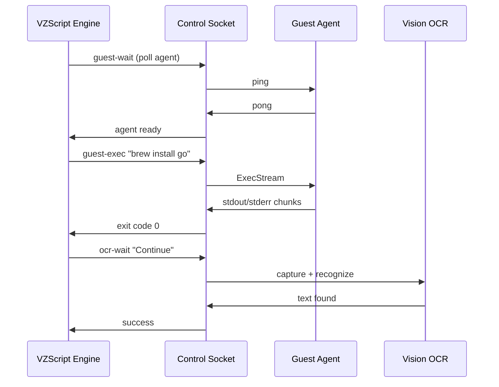

# Architecture Overview

## System Architecture



## Component Responsibilities

### CLI Layer (main.go, cli_help.go)

Subcommand routing and flag parsing. All commands share global flags (`-vm`, `-verbose`, etc.) and resolve the VM directory through the registry.

### Virtualization Layer (macos.go, linux.go, installer.go)

Creates and configures VMs using Apple's Virtualization.framework through purego. macOS VMs use `VZMacOSVirtualMachineStartOptions` with `VZMacOSBootLoader`. Linux VMs use `VZEFIBootLoader` with a generic platform.

### Control Socket (control_socket.go, proto/control.proto)

A Unix domain socket server that accepts JSON-encoded protobuf requests. Every running VM creates a socket at `~/.vz/vms/<name>/control.sock` with a per-VM bearer token.

The control socket multiplexes:
- Input events (keyboard, mouse, text)
- Screenshots and OCR
- VM lifecycle (pause, resume, stop)
- Snapshot management
- Guest agent proxy
- Memory balloon control
- Port forwarding

### VZScript Engine (vzscript.go, vzscript_apply.go)

Extends rsc.io/script with guest and UI automation commands. Scripts are txtar archives with embedded files. The engine resolves dependencies between recipes and routes commands through the control socket.

### Screenshots and OCR (screenshots.go, ocr.go)

Screenshots use `CGWindowListCreateImage` (thread-safe, no main queue dispatch needed). OCR uses Apple's Vision framework. Both are exposed through the control socket for remote access.

### Provisioning (provision*.go)

Pre-boot disk injection that mounts the VM's APFS image and writes files for user creation, auto-login, Setup Assistant bypass, and guest agent installation.

### Guest Agent (cmd/vz-agent/)

A Go binary running inside the guest as a LaunchDaemon. Communicates with the host over vsock gRPC. Two instances: root daemon (port 1024) for system operations and user agent for TCC-accessible operations.

## VM Directory Layout

```
~/.vz/vms/<name>/
+-- disk.img               # main storage (sparse APFS or ext4)
+-- aux.img                # macOS auxiliary storage (NVRAM)
+-- hw.model               # hardware model identifier (macOS)
+-- machine.id             # machine identifier (macOS)
+-- efi.nvram              # EFI variable store (Linux)
+-- control.sock           # control socket (when running)
+-- control.token          # auth token (0600)
+-- suspend.vmstate        # saved suspend state
+-- config.json            # VM configuration
+-- shared_folders.json    # shared folder config
+-- snapshots/             # VM state snapshots
+-- .provision/            # staged provisioning files
```

## Data Flow

### VM Startup



### VZScript Execution



## Threading Model

- The main goroutine is locked to the OS thread for AppKit/NSApplication
- VM operations dispatch to a serial GCD queue (`com.appledocs.vz.vm`)
- Control socket runs on its own goroutine, dispatching to the VM queue as needed
- `CGWindowListCreateImage` is thread-safe (no main queue required)
- `CGEventCreateKeyboardEvent` is used instead of `NSEvent` for keyboard input (avoids ARM64 purego parameter corruption beyond argument position 8)
